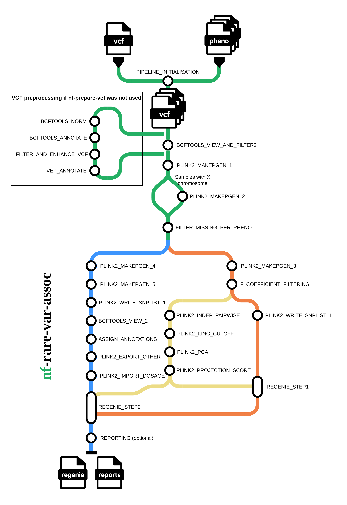

# nf-rare-var-assoc

[](https://github.com/psuszyns/rare-var-assoc-nf/actions/workflows/ci.yml)
[](https://www.nf-test.com)
[](https://www.nextflow.io/)
[](https://www.docker.com/)
[](https://sylabs.io/docs/)
[](https://docs.conda.io/en/latest/)

## Introduction

**nf-rare-var-assoc** is a Nextflow pipeline for rare-variant association studies.
It ingests a multi-sample VCF and case/control sample lists, delegates VCF preparation
(normalisation, deduplication, VEP annotation, dosage calculation) to
[nf-prepare-vcf](https://github.com/psuszyns/nf-prepare-vcf), then runs variant filtering, including per-phenotype missingness filtering, F-coefficient filtering, kinship filtering, PCA, Regenie step1/step2 association tests, and
produces association results, including an HTML report with data characteristics plots, Manhattan plots and QQ plots.



## Usage

### Required parameters

| Parameter | Description |
|---|---|
| `--input_vcf` | Path to the input multi-sample VCF |
| `--outdir` | Output directory path |

### Optional input parameters

| Parameter | Description |
|---|---|
| `--input_cases` | Directory containing case sample-ID files |
| `--input_controls` | Directory containing control sample-ID files |
| `--input_phenotype` | Path to a tab-separated phenotype file (alternative to cases/controls files) |
| `--input_masks` | Path to a masks file defining variant annotation groups for aggregation tests |
| `--project_name` | Short project identifier used in output filenames |

### Run command

```bash
nextflow run main.nf \
    --input_vcf /path/to/input.vcf.gz \
    --input_cases /path/to/cases \
    --input_controls /path/to/controls \
    --outdir results \
    --project_name myproject
```

### Pipeline behaviour

| Parameter | Default | Description |
|---|---|---|
| `--skip_preparation` | `false` | Skip VCF preparation |
| `--skip_reporting` | `false` | Skip the reporting subworkflow |
| `--use_dosage` | `false` | Use DS (dosage) field instead of hard genotype calls in Regenie |
| `--publish_intermediate` | `false` | Copy intermediate files to `--outdir` |
| `--regenie_step1_kinship_filtering` | `false` | Enable kinship-based sample filtering for Regenie step 1 input |
| `--cpu_support_avx2` | `true` | Use AVX2-optimised PLINK2 binary; set to `false` on older CPUs |
| `--tmpdir` | _(Nextflow default)_ | Override temporary directory for all processes |
| `--errorStrategy` | _(Nextflow default)_ | Override process error strategy (on top of standard strategies we support additional `retryThenIgnore` strategy) |

### Production modes

**Main path (`--skip_preparation false  --skip_reporting false`, default)** - runs the full pipeline including a
nested call to `nf-prepare-vcf` for VCF preparation (bcftools normalisation and deduplication, VEP
annotation, dosage calculation). This is the main mode, in which association testing is executed for given input.

**HPC param-tuning path (`--skip_preparation true --skip_reporting true`)** - skips preparation and expects
a pre-prepared VCF. This is used by `nextflow-gene-assoc-tuner` for tuning the parameters of this pipeline (listed below) on synthetic datasets. `nextflow-gene-assoc-tuner` will call `nf-prepare-vcf` once and then `nf-rare-var-assoc` multiple times with different parameters.

### VCF quality filters

These parameters control the per-variant and per-genotype quality thresholds applied during VCF filering.

| Parameter | Default | Description |
|---|---|---|
| `--filter_vcf_qual_min` | `25` | Minimum variant QUAL score |
| `--filter_vcf_avg_gq_min` | `25` | Minimum average GQ across samples |
| `--filter_vcf_avg_dp_min` | `25` | Minimum average DP across samples |
| `--filter_vcf_avg_dp_max` | `200` | Maximum average DP across samples |
| `--filter_vcf_sample_gq_min` | `20` | Per-sample GQ below which GT is set to missing (./.) |
| `--filter_vcf_sample_dp_min` | `20` | Per-sample minimum DP |
| `--filter_vcf_sample_dp_max` | `250` | Per-sample maximum DP |

### PLINK2 QC parameters

After initial common steps the pipeline branches to four paths:
 1. data flowing to F-coefficient filtering
 2. data flowing to PCA
 3. data flowing to Regenie step 1
 4. data flowing to Regenie step 2

Each has different variants&samples filtering settings, controled by parameters below. The F-coefficient filtering output is used for PCA and for Regenie step 1. The PCA output (covariates) is used in both Regenie step 1 and step 2.

| Parameter | Default | Description |
|---|---|---|
| `--plink2_makepgen_1_options` | `--double-id --vcf-half-call missing --split-par b38 --1` | Options for initial VCF-to-pgen import (common step) |
| `--plink2_makepgen_2_options` | `--impute-sex max-female-xf=0.2 min-male-xf=0.8` | Sex imputation thresholds (common step) |
| `--plink2_makepgen_3_options` | `--geno 0.1 --hwe 1e-13 0.001 --mac 70 --maf 0.01` | Common-variant QC filtering (Regenie step 1 and PCA paths) |
| `--plink2_missing_per_pheno_options` | `--geno 0.2` | Per-phenotype variant missingness filtering (Regenie step 1 and PCA paths) |
| `--inbreeding_outliers_range_stds` | `6` | Standard deviations from mean F-coefficient for outlier detection (Regenie step 1 and PCA paths) |
| `--plink2_indep_pairwise_options` | `--mind 0.1` | Additional QC filtering for F-coefficient filtering path and for PCA path |
| `--plink2_write_snplist_qc_options` | `--mind 0.1` | Additional QC filtering and exporting SNP list for Regenie step 1 |
| `--plink2_makepgen_4_options` | `--geno 0.2` | QC genotype missingness filter (Regenie step 2 path) |
| `--plink2_makepgen_5_options` | `--mind 0.2` | Per-sample missingness filter (Regenie step 2 path) |
| `--plink2_write_snplist_step2_options` | `--mind 0.2` | Additional filters for Regenie step 2 variant list |
| `--plink2_indep_pairwise_window` | `50 5 0.2` | LD pruning window settings for F-coefficient filtering path |
| `--plink2_indep_pairwise_window_pca` | `500 50 0.2` | LD pruning window settings for PCA |
| `--plink2_king_cutoff_threshold_pca` | `0.0884` | KING relatedness cutoff for PCA sample selection |
| `--plink2_pca_settings` | `allele-wts 10` | PCA computation settings (number of PCs) |

### Regenie parameters

| Parameter | Default | Description |
|---|---|---|
| `--regenie_step1_options` | `--bt --bsize 100 --lowmem --covarColList PC1_AVG,PC2_AVG` | Regenie step 1 options (ridge regression) |
| `--regenie_step2_options` | `--bt --minMAC 1 --ref-first --firth --approx --bsize 200 --lowmem --aaf-bins 0.01,0.05,0.1,1 --write-mask --write-mask-snplist --vc-tests skato --covarColList PC1_AVG,PC2_AVG` | Regenie step 2 options (association testing) |
| `--rscript_annotate_options` | `--min_top_annotations 30 --max_annotations 62 --quantile_threshold 0.25 --include-intergenic FALSE` | Options for the variant annotation |


## Testing

Requires [nf-test](https://www.nf-test.com/) and Nextflow >=25.10.2.

```bash
# Fast CI suite
nf-test test --tag ci

# Full suite (includes slow tests)
nf-test test
```

## Citations

This pipeline uses code and infrastructure developed and maintained by the
[nf-core](https://nf-co.re) community, reused here under the
[MIT license](https://github.com/nf-core/tools/blob/main/LICENSE).

> **The nf-core framework for community-curated bioinformatics pipelines.**
>
> Philip Ewels, Alexander Peltzer, Sven Fillinger, Harshil Patel, Johannes Alneberg, Andreas Wilm, Maxime Ulysse Garcia, Paolo Di Tommaso & Sven Nahnsen.
>
> _Nat Biotechnol._ 2020 Feb 13. doi: [10.1038/s41587-020-0439-x](https://dx.doi.org/10.1038/s41587-020-0439-x).

## Copyright

Copyright (c) 2026 Piotr Suszyński, Tomasz Gambin. All rights reserved.

This software is proprietary. No part of it may be reproduced, distributed, or used
in any form without explicit written permission from the copyright holders.

A licence to use this software free of charge for scientific and non-profit purposes
may be obtained from the authors upon request.
