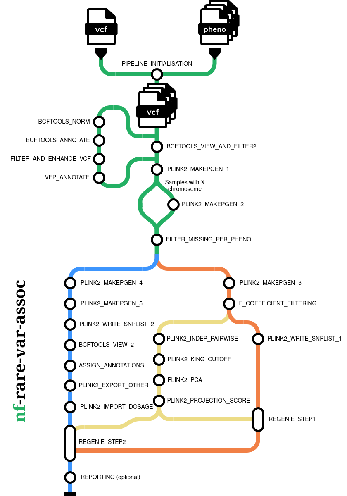

# nf-rare-var-assoc

[](https://github.com/psuszyns/rare-var-assoc-nf/actions/workflows/ci.yml)
[](https://www.nf-test.com)
[](https://www.nextflow.io/)
[](https://www.docker.com/)
[](https://sylabs.io/docs/)
[](https://docs.conda.io/en/latest/)

## Introduction

**nf-rare-var-assoc** is a Nextflow pipeline for rare-variant association studies. It
takes a multi-sample VCF and a case/control assignment and produces gene-level
association results, together with a report containing Manhattan plots, QQ plots and
data-quality figures.

It covers the whole analysis in one workflow: preparing and normalising the VCF,
annotating variants with VEP, deriving genotype dosages from genotype likelihoods,
variant and sample quality control, correcting for population structure, grouping
variants into genes by predicted functional impact, running the association tests with
REGENIE, and reporting. Each step records how many samples and variants entered and left
it, so the whole run can be audited afterwards.



## What the pipeline does

1. **Prepares the VCF**: sorting, splitting multi-allelic sites, removing exact
   duplicates, assigning variant identifiers, VEP annotation, and computing dosages from
   genotype likelihoods. Delegated to
   [nf-prepare-vcf](https://github.com/biodatageeks/nf-prepare-vcf).
2. **Filters variants** on site quality and on per-genotype quality and depth, then
   applies PLINK2 quality control with **different thresholds for each downstream use**.
3. **Filters samples** per-phenotype missingness, and removal of
   inbreeding-coefficient outliers. Also, sex imputation.
4. **Corrects for population structure**: linkage-disequilibrium pruning, relatedness
   estimation, principal-component analysis, and projection of every sample onto the
   resulting components.
5. **Groups variants into genes** by VEP consequence, producing per-gene variant sets,
   annotation files, impact tiers and allele-frequency groups.
6. **Tests for association** with REGENIE: a whole-genome step followed by burden and SKAT-O tests across several allele-frequency thresholds, with Firth/SPA imbalance correction.
7. **Reports**: Manhattan and QQ plots, data-quality figures,
   principal-component plots, an HTML report, and a per-step record of
   how the data flowed through the pipeline.

A fuller description of each step, and why the quality-control thresholds differ between
them, is in [docs/pipeline.md](docs/pipeline.md).

## Requirements

- [Nextflow](https://www.nextflow.io/) 25.10.2 or newer, and Java 17 or newer.
- A container engine: Docker, Podman, Singularity or Apptainer.

No reference data has to be downloaded in advance - the VEP cache and reference genome
are fetched by the preparation step on first use.

## Quick start

```bash
nextflow run main.nf -profile docker \
    --input_vcf     /path/to/input.vcf.gz \
    --input_cases   /path/to/cases.txt \
    --input_controls /path/to/controls.txt \
    --project_name  myproject \
    --outdir        results
```

Instead of separate case and control lists you can supply a single phenotype file:

```bash
nextflow run main.nf -profile docker \
    --input_vcf        /path/to/input.vcf.gz \
    --input_phenotype  /path/to/phenotype.tsv \
    --project_name     myproject \
    --outdir           results
```

Both input styles, their file formats, every parameter, and how to run on a cluster are
described in [docs/usage.md](docs/usage.md).

## What you get

These are written to `--outdir` by default:

| Location under `--outdir` | What it is |
|---|---|
| `rscript_manhattan_qq_plots/*.html` | the main report: Manhattan plots, QQ plots, phenotype summaries and data-quality figures |
| `regenie_step2/*_step2_<phenotype>.regenie` | the association results, one row per gene, test and allele-frequency group |
| `rscript_buildreports/*_annotated_snps_with_sample_ids.csv` | per-variant case and control allele counts and frequencies, with the carrier sample identifiers |
| `generate_tracking_report/*_sankey_report.html` | how many samples and variants each step kept or removed |
| `multiqc/multiqc_report.html` | combined tool-level quality report |
| `pipeline_info/` | Nextflow's own execution report, timeline and trace |

Adding `--publish_intermediate true` also writes the output of every intermediate step,
including the data-analysis figures, the principal components and the gene
groupings. Every output directory is described in [docs/output.md](docs/output.md).

## Documentation

| Page | Contents |
|---|---|
| [docs/usage.md](docs/usage.md) | Input file formats, how to run the pipeline, the complete parameter reference, running on a cluster, and troubleshooting |
| [docs/output.md](docs/output.md) | Every output directory and file, and how to interpret them |
| [docs/pipeline.md](docs/pipeline.md) | What each analysis step does and why |
| [docs/tool-comparison/](docs/tool-comparison/) | The benchmark comparing this pipeline against other rare-variant analysis software |

## Testing

Requires [nf-test](https://www.nf-test.com/) and Nextflow 25.10.2 or newer.

```bash
# fast suite, as run in continuous integration
nf-test test --tag ci --profile low_resources

# full suite, including slow integration tests
nf-test test --profile low_resources
```

The `low_resources` profile caps the memory each process requests so the suite runs on an
ordinary workstation.

## Citations

This pipeline uses code and infrastructure developed and maintained by the
[nf-core](https://nf-co.re) community, reused here under the
[MIT license](https://github.com/nf-core/tools/blob/main/LICENSE).

## License

Copyright (c) 2026 Piotr Suszyński, Tomasz Gambin.

This pipeline is free software: you can redistribute it and/or modify it under the
terms of the GNU General Public License as published by the Free Software Foundation,
either version 3 of the License, or (at your option) any later version. See the
[LICENSE](LICENSE) file for the full text.

It is distributed in the hope that it will be useful, but WITHOUT ANY WARRANTY;
without even the implied warranty of MERCHANTABILITY or FITNESS FOR A PARTICULAR
PURPOSE.
